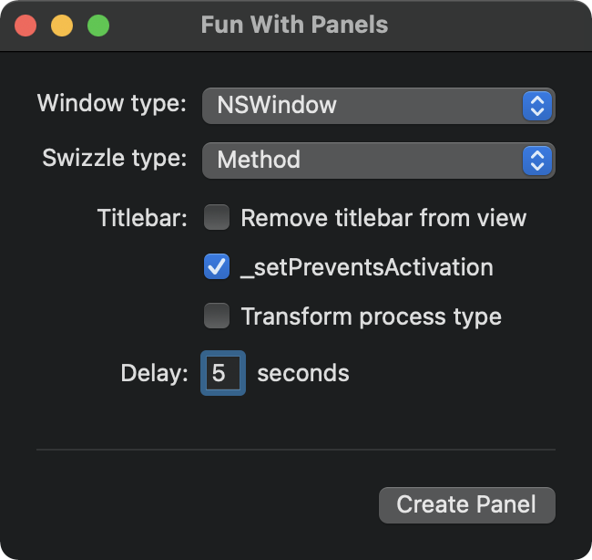

# FunWithPanels

A little app which shows different ways to simulate NSPanel using NSWindow, for better or worse.



## Settings

FunWithPanels uses a combination of swizzling and other techniques which you can mix and match.
### 1. Window Type

Generally you want this to be NSWindow, but a real NSPanel is included for comparison.

### 2. Swizzle Type

Some properties which make a window behave like a panel are ignored if set on NSWindow, but we can swizzle the window to apply them anyway. Two forms of swizzling are implemented, method and class:
 
-  **Method swizzling** exchanges computed properties on NSWindow with our own versions. This exchange affects _all_ instances of NSWindow, so we set an associated object on our panel window to make it possible for the property getters to know whether or not to apply the custom behaviour.

```swift
extension NSWindow {
    @objc var nonActivatingStyleMask: NSWindow.StyleMask {
        if let _ = objc_getAssociatedObject(self, &NonActivatingHandle) {
            return [.fullSizeContentView, .nonactivatingPanel]
        } else {
            // Not an infinite loop because because method swizzling
            // swapped the original NSWindow property for this one.
            return self.nonActivatingStyleMask
        }
    }
}

// Exchange properties
let styleMaskOriginal = class_getInstanceMethod(NSWindow.self, #selector(getter: NSWindow.styleMask))
let styleMaskNew = class_getInstanceMethod(NSWindow.self, #selector(getter: NSWindow.nonActivatingStyleMask))
method_exchangeImplementations(styleMaskOriginal!, styleMaskNew!)

// Flag our window as a panel
objc_setAssociatedObject(window, &NonActivatingHandle, true, .OBJC_ASSOCIATION_COPY)

```

- **Class swizzling** is both a bit simpler and potentially more invasive. It converts the panel window to our own subclass with overriden properties. No other windows are affected and no associated object is required, but our window may run into trouble if it was originally a different subclass of NSWindow.

```swift
class NonactivatingWindow: NSWindow {
    override var styleMask: NSWindow.StyleMask {
        get {
            [.fullSizeContentView, .nonactivatingPanel]
        }
        set {
            super.styleMask = newValue
        }
    }
}

object_setClass(window, NonactivatingWindow.self)
```
### 3. Remove titlebar from view

Normal windows (including NSPanel) have a titlebar area, even if it is completely hidden. The titlebar area provides a drag region and is also responsible for drawing the window border and shadow. But it poses a problem for us, because clicking into it can activate the app even after swizzling the window.

We can remove the titlebar forcefully with `styleMask.remove(.titled)`, but this requires us to recreate a custom window border and frame. The result won't look or work exactly the same as a titled window. (Compare Alfred, which does not use a titled panel, with Spotlight, which does.)

More importantly, removing the titlebar from an existing window may break any code which expects it to exist.

Titled window with hidden title:


Non-titled window with custom frame:


### 4. _setPreventsActivation

This API completely stops the window from activating, even when clicking the titlebar area. The two caveats are 1) it's a private API, and 2) swizzling must still be used to allow the window to appear over fullscreen apps.

### 5. Transform Process Type

One way to prevent activation is to transform the process type to UIElement. Transforming the process type allows the window to appear over full screen apps, and it does not require swizzling or private APIs. But it affects every window in the app, and it makes the Dock icon disappear. So it's only suitable if the window will only appear when no windows are open and the Dock icon is already hidden, or if the window belongs to its own process.

### 6. Delay

Show the panel after a delay, giving you time to switch to a different window, space, or full screen app.